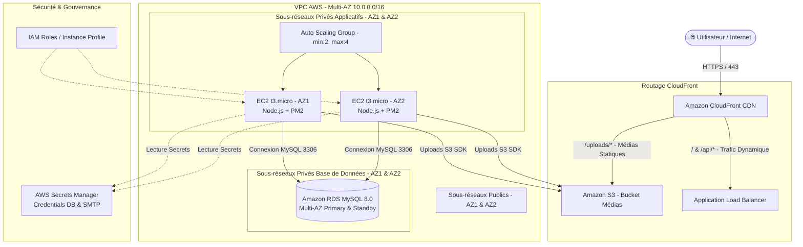
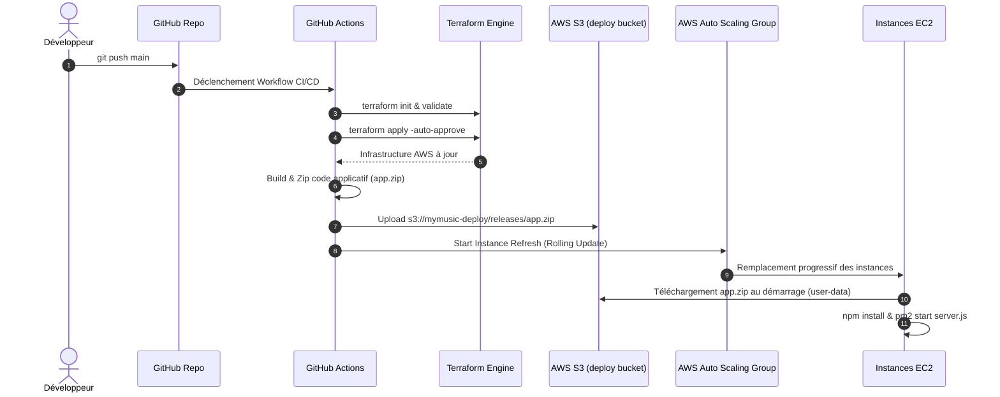

# Architecture Cloud AWS — My Music

Ce document décrit l'architecture cible déployée sur **Amazon Web Services (AWS)** pour l'application **My Music**, conçue selon les 6 piliers du **AWS Well-Architected Framework**, sans conteneurisation et sans SNS.

---

## 🏛️ Schéma d'Architecture Global



---

## 🌐 Schéma Réseau & Segmentation (VPC Topologie)

```text
+-----------------------------------------------------------------------------------+
| AWS VPC (10.0.0.0/16)                                                             |
|                                                                                   |
|  +-------------------------------------+   +-----------------------------------+  |
|  | Subnet Public AZ1 (10.0.0.0/24)    |   | Subnet Public AZ2 (10.0.1.0/24)   |  |
|  |  [ Application Load Balancer (ALB) ]|   |  [ Application Load Balancer (ALB)]|  |
|  +------------------+------------------+   +-----------------+-----------------+  |
|                     |                                        |                    |
|  ===================|========================================|==================  |
|                     v                                        v                    |
|  +-------------------------------------+   +-----------------------------------+  |
|  | Subnet Privé App AZ1 (10.0.2.0/24)  |   | Subnet Privé App AZ2 (10.0.3.0/24)|  |
|  |  [ EC2 Instance 1 (Node.js + PM2) ] |   |  [ EC2 Instance 2 (Node.js + PM2)]|  |
|  +------------------+------------------+   +-----------------+-----------------+  |
|                     |                                        |                    |
|  ===================|========================================|==================  |
|                     v                                        v                    |
|  +-------------------------------------+   +-----------------------------------+  |
|  | Subnet Privé DB AZ1 (10.0.4.0/24)   |   | Subnet Privé DB AZ2 (10.0.5.0/24)  |  |
|  |  [ RDS MySQL Primary Instance ]     |===|  [ RDS MySQL Standby Replica ]    |  |
|  +-------------------------------------+   +-----------------------------------+  |
+-----------------------------------------------------------------------------------+
```

---

## 🔒 Flux de Sécurité (Security Groups)

```
[ Internet ] 
     │
     │ HTTP (80) / HTTPS (443)
     ▼
┌──────────────────────────────────────┐
│  Security Group: mymusic-alb-sg      │
│  Inbound:  0.0.0.0/0 (80, 443)      │
│  Outbound: All Traffic              │
└──────────────────┬───────────────────┘
                   │
                   │ Port 3000 (Node.js)
                   ▼
┌──────────────────────────────────────┐
│  Security Group: mymusic-ec2-sg      │
│  Inbound:  mymusic-alb-sg (3000)     │
│  Outbound: All Traffic (NAT/S3/SM)   │
└──────────────────┬───────────────────┘
                   │
                   │ Port 3306 (MySQL)
                   ▼
┌──────────────────────────────────────┐
│  Security Group: mymusic-rds-sg      │
│  Inbound:  mymusic-ec2-sg (3306)     │
│  Outbound: None                      │
└──────────────────────────────────────┘
```

---

## 🔄 Pipeline de Déploiement CI/CD (GitHub Actions)



---

## 📊 Récapitulatif des Composants AWS

| Composant | Service AWS | Rôle dans l'application |
|---|---|---|
| **Équilibrage de charge** | **Application Load Balancer (ALB)** | Reçoit le trafic public et le distribue sur les EC2 privées. |
| **Serveurs applicatifs** | **EC2 + Auto Scaling Group** | Exécute l'application Node.js via PM2 sur 2 AZs sans conteneurs. |
| **Base de données** | **RDS MySQL Multi-AZ** | Stockage relationnel haute disponibilité avec réplication synchrone. |
| **Stockage Fichiers** | **Amazon S3** | Stocke les audios et couvertures uploadés (partagé inter-instances). |
| **CDN & Accélération** | **Amazon CloudFront** | Distribue les assets statiques et médias au plus près des utilisateurs. |
| **Gestion des Secrets** | **AWS Secrets Manager** | Chiffre et injecte les identifiants DB et SMTP de manière sécurisée. |
| **Sécurité IAM** | **IAM Roles & Instance Profile** | Accès S3 et Secrets Manager sans aucune clé statique en dur. |
| **Infrastructure as Code** | **Terraform** | Déclaration et gestion reproductible de 100% des ressources Cloud. |
| **Automation CI/CD** | **GitHub Actions** | Déploiement continu automatisé à chaque push sur la branche main. |
